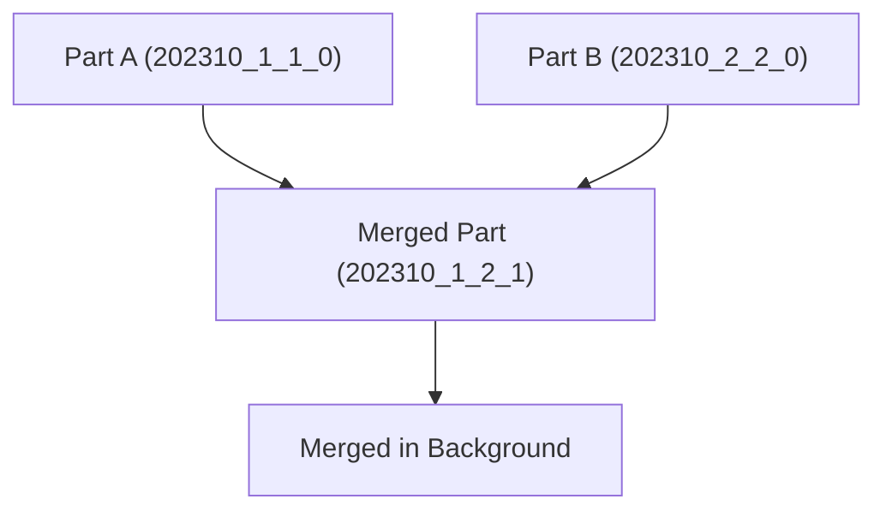

<p class="lead text-xl text-gray-300 mb-8">
    If ClickHouse is a race car, the MergeTree engine is its V12 engine. It is the foundation of almost all high-performance tables in ClickHouse. If you don't understand how MergeTree stores, sorts, and merges data on disk, you will write slow tables and query them like a novice. Let's lift the hood and look at the physical files.
</p>

## B-Tree vs. Sparse Index: The Core Paradigm Shift

In standard OLTP databases (like PostgreSQL), indexes are built using **B-Trees**. A B-Tree index contains pointers to the *exact* physical location of every single row. If you query `WHERE id = 42`, the B-Tree tells the database precisely which disk block to read. 

This is great for transaction processing but terrible for analytics. If you have 500 million rows, a B-Tree index becomes massive, consuming gigabytes of RAM. 

ClickHouse does not use B-Trees. It uses a **Sparse Index**. 

Instead of pointing to individual rows, the primary key in ClickHouse sorts the data on disk and creates an index entry only once every **8,192 rows** (this block is called a **Mark Range**).


*Data engineers showing their DBAs a ClickHouse primary key vs a Postgres primary key. "It's the same name, but one doesn't eat all your RAM for breakfast."*

> **ELI5:** What is index granularity and sparse indexing? Imagine sorting letters into bundles instead of filing them one by one. Check out [ELI5: The MergeTree Engine](/blog/eli5/mergetree) for the full analogy.

---

## What Happens on Disk?

Let’s look at what ClickHouse writes to disk when you create a table and insert data. 

### Creating the Table
```sql
CREATE TABLE hits (
    timestamp DateTime,
    user_id UInt64,
    url String,
    event_type Enum('view' = 1, 'click' = 2)
) ENGINE = MergeTree()
PARTITION BY toYYYYMM(timestamp)
ORDER BY (timestamp, user_id)
SETTINGS index_granularity = 8192;
```

When you write data to this table, ClickHouse creates a new directory inside `/var/lib/clickhouse/data/default/hits/` for each insert batch. Let's inspect the files in one of these directories:

* **`primary.idx`:** The sparse index file. It contains the primary keys (`timestamp`, `user_id`) for every 8,192nd row in the part. Since it only contains 1 out of every 8,192 values, it is tiny and fits entirely in RAM.
* **`[column].bin`:** The compressed binary data for each column (e.g., `url.bin`, `user_id.bin`).
* **`[column].mrk2`:** The "mark" files. These serve as a map. They translate the indexes in `primary.idx` into physical file offsets in `[column].bin` so ClickHouse knows exactly where to jump to start reading.

If you run `SELECT COUNT(url) FROM hits WHERE timestamp >= '2023-10-01 00:00:00'`, ClickHouse:
1. Searches `primary.idx` in memory to find the Mark Ranges that match the timestamp.
2. Reads the `url.mrk2` file to locate the exact offset in `url.bin`.
3. Opens `url.bin` at that offset, decompresses the blocks, and aggregates the values.
4. It never opens or reads `user_id.bin` or `event_type.bin`.

---

## The Magic of Partitioning

Partitioning is the process of physically splitting your table files into separate directories on disk based on a column or expression. 

In our schema, we partitioned by month: `PARTITION BY toYYYYMM(timestamp)`.

> **ELI5:** What is partitioning? Think of it like sorting your receipts into yearly drawers and monthly folders so you don't have to scan a single giant box in your attic. Check out [ELI5: Database Partitioning](/blog/eli5/partitioning) for the breakdown.

If you run `SELECT * FROM hits WHERE timestamp BETWEEN '2023-10-01' AND '2023-10-15'`, ClickHouse checks the partition key and only searches directories matching `202310`. It completely skips the folders for `202309`, `202308`, and so on. This is called **Partition Pruning**.

For official partitioning settings and caveats, consult the [ClickHouse Partitioning Documentation](https://clickhouse.com/docs/en/engines/table-engines/mergetree-family/custom-partitioning-key).

### The Directory Naming Rule
When data is written, ClickHouse writes folders named like this:
```text
202310_1_1_0
202310_2_2_0
```
Let's break down `202310_1_1_0`:
* `202310`: The partition ID (October 2023).
* `1`: The minimum block number of the insert.
* `1`: The maximum block number of the insert.
* `0`: The mutation version (incremented if the data is mutated or updated in place).

---

## The Merge Process

Every time you execute an `INSERT` statement, ClickHouse creates a new physical folder (part) on disk. 

If you insert 1 row per second, you will quickly end up with thousands of folders. Opening thousands of folders and files to answer a query will kill performance (often leading to the `Too many parts` error).

To prevent this, ClickHouse's background processes merge these folders. 



During a merge:
1. ClickHouse reads two or more adjacent parts for the same partition.
2. It combines the rows, keeping them sorted by the `ORDER BY` key.
3. It writes a brand-new folder, e.g., `202310_1_2_1`.
4. It marks the old folders (`202310_1_1_0` and `202310_2_2_0`) as inactive and deletes them after a short delay (usually 10 minutes).

Because the parts are already sorted, merging them is an extremely efficient **external merge sort** operation. It does not stress the CPU, but it does consume disk I/O.

---

## Best Practices for MergeTree Schemas

1. **Keep the Partition Cardinality Low:** Do not partition by date down to the day or by `user_id`. Aim for less than 1,000 total partitions in a table. Partitioning by month (`toYYYYMM(timestamp)`) is the golden standard.
2. **Order Matters in Primary Keys:** Keep your primary key (`ORDER BY`) small (typically 2-4 columns). Place the columns you filter by most frequently first. Order from lowest cardinality to highest cardinality. For example, `ORDER BY (event_type, user_id, timestamp)` is often much faster than placing `timestamp` first if you always filter by `event_type` first.

For further reference, read the [Official ClickHouse MergeTree Engine Docs](https://clickhouse.com/docs/en/engines/table-engines/mergetree-family/mergetree).

Now that you know how the engine writes files, we'll look at how to model complex structures and denormalize data in Part 4.

<div class="flex justify-between mt-12 pt-8 border-t border-gray-700">
    <a href="/blog/clickhouse/02-installation" class="text-pink-400 hover:text-pink-300 font-bold">&larr; Part 2 - Installation</a>
    <a href="/blog/clickhouse/04-modeling" class="text-pink-400 hover:text-pink-300 font-bold">Next: Part 4 - Data Modeling &rarr;</a>
</div>
