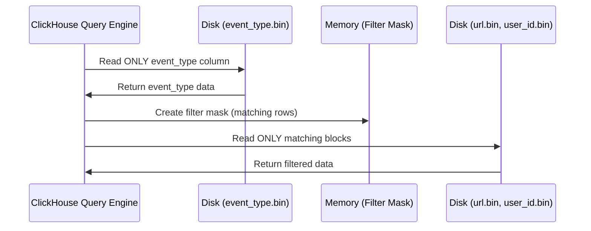

<p class="lead text-xl text-gray-300 mb-8">
    ClickHouse is ANSI SQL compliant. If you know how to write standard SELECT statements, you can write ClickHouse queries immediately. But if you want to scan billions of records in under a second, you need to understand ClickHouse's execution extensions. Let's master the art of writing highly optimized analytical queries.
</p>

## The Secret Weapon: `PREWHERE`

In standard SQL databases, filtering is straightforward: you use `WHERE`. The engine reads all the columns in your query, evaluates the filter conditions for each row, and discards rows that don’t match.

ClickHouse introduces a major performance optimization called **`PREWHERE`**.

### How `PREWHERE` Works Under the Hood
Imagine your query is:
```sql
SELECT user_id, url, user_agent 
FROM hits 
PREWHERE event_type = 'click';
```
Here is the step-by-step physical execution:
1. ClickHouse opens *only* the column file for `event_type` (`event_type.bin`).
2. It scans the values and creates a bitmask of matching row indices.
3. It filters out all non-matching row indices.
4. **Only then** does it open `user_id.bin`, `url.bin`, and `user_agent.bin`, reading *only* the specific blocks corresponding to the matching row indices.

If only 1% of your rows match the filter, `PREWHERE` saves you from reading 99% of the data in the other three columns. This is a massive I/O saver.



### When to write `PREWHERE` explicitly
By default, the ClickHouse optimizer automatically moves conditions from `WHERE` to `PREWHERE` when it detects it is safe to do so. However, the optimizer can be conservative. It will *not* automatically move your filter if:
* The column you are filtering by is also in your SELECT clause (though newer versions do this better).
* Your filter contains complex expressions or subqueries.
* You disabled the automatic optimization (`SET optimize_move_to_prewhere = 0`).

To guarantee max performance, write `PREWHERE` explicitly for your primary filters:
```sql
SELECT customer_name, revenue 
FROM orders_flat 
PREWHERE customer_country = 'US' 
WHERE revenue > 100.0;
```
For more information, see the [ClickHouse PREWHERE Documentation](https://clickhouse.com/docs/en/sql-reference/statements/select/prewhere).

---

## Aggregations on Steroids

OLAP databases live and die by aggregation speed. ClickHouse uses highly optimized C++ algorithms to make aggregations run at CPU register speeds.

### `count()` vs. `count(column)`
* `count()`: This is the fastest way to get row counts. In ClickHouse, `count()` does not scan actual data. If there are no filters, it pulls the count from the metadata. If there are filters, it scans the smallest column (e.g. an integer or LowCardinality column) to get the count.
* `count(column)`: Compels ClickHouse to scan that specific column file and count only rows that are not null. Never do this unless you explicitly need to exclude null values.

### Approximate Cardinality with HyperLogLog (`uniq`)
If you want to count unique users on a high-traffic site, running `COUNT(DISTINCT user_id)` (or `uniqExact(user_id)`) requires loading all unique values into a hash table in memory. If you have 50 million unique users, your query will run out of memory.

Instead, use `uniq(user_id)`.

`uniq()` uses the **HyperLogLog** algorithm. It provides an extremely accurate approximation (typically within 1% error) while using a tiny, fixed amount of memory. It runs up to **20x faster** than `uniqExact()`.

For exact counts, use `uniqExact()`, but reserve it for smaller datasets or reports where approximation is legally or financially unacceptable.


*POV: Watching the ClickHouse server run out of memory because you ran uniqExact() on a high-cardinality ID column across a 10-billion row table instead of using uniq().*

### Calculating Latency Percentiles (`quantile`)
If you are analyzing system performance or API latencies, calculating the average latency is useless. A few extremely slow queries can hide behind a good average. You want percentiles (e.g., p95 or p99).

ClickHouse has a specialized aggregate function for this:

```sql
SELECT
    product_category,
    avg(price) AS avg_price,
    quantile(0.50)(price) AS p50_price,
    quantile(0.95)(price) AS p95_price,
    quantile(0.99)(price) AS p99_price
FROM orders_flat
GROUP BY product_category;
```

You can even calculate multiple percentiles in a single function call using `quantiles`:

```sql
SELECT quantiles(0.5, 0.9, 0.99)(price) FROM orders_flat;
```

---

## Advanced Time Series Aggregation

ClickHouse has an extensive library of functions for slicing and dicing time. The most important functions for real-time dashboards are the `toStartOf*` family.

Instead of writing complex SQL string manipulation to group by 5-minute intervals:

```sql
SELECT
    -- Groups timestamps into clean 5-minute buckets
    toStartOfInterval(timestamp, INTERVAL 5 MINUTE) AS time_bucket,
    count() AS total_transactions,
    sum(revenue) AS total_revenue
FROM orders_flat
WHERE timestamp >= now() - INTERVAL 24 HOUR
GROUP BY time_bucket
ORDER BY time_bucket ASC;
```

Common date rounding functions include:
* `toStartOfHour(timestamp)`
* `toStartOfDay(timestamp)`
* `toStartOfMonth(timestamp)`

For timezone manipulation, you can pass the timezone as the second argument:
```sql
SELECT toStartOfDay(timestamp, 'America/New_York') FROM orders_flat;
```
For the complete catalog of date/time functions, consult the [ClickHouse Date and Time Functions Reference](https://clickhouse.com/docs/en/sql-reference/functions/date-time-functions).

Now that we have querying basics down, let's explore ClickHouse's support for complex data types like Arrays, Maps, and Window Functions in Part 7.

<div class="flex justify-between mt-12 pt-8 border-t border-gray-700">
    <a href="/blog/clickhouse/05-ingestion" class="text-pink-400 hover:text-pink-300 font-bold">&larr; Part 5 - Ingestion</a>
    <a href="/blog/clickhouse/07-advanced" class="text-pink-400 hover:text-pink-300 font-bold">Next: Part 7 - Advanced Features &rarr;</a>
</div>
