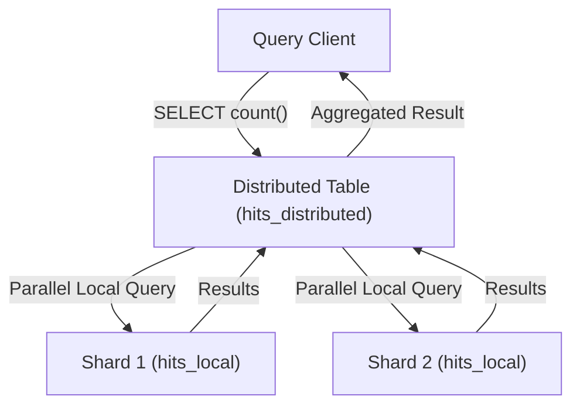

<p class="lead text-xl text-gray-300 mb-8">
    You've made it to the final part of the ClickHouse series! We've covered everything from installing a single container to tuning column codecs and writing materialized views. Now, it's time to think big. When your clickstream hits billions of rows per day, a single node will run out of disk or CPU. Let's scale horizontally.
</p>

## The Scaling Architecture: Sharding vs. Replication

In ClickHouse, scaling out is divided into two distinct components:

1. **Replication (High Availability & Read Scalability):** Copies the same data across multiple nodes (replicas). If Replica A crashes, Replica B is ready to handle queries. Replication is handled at the *storage engine* layer.
2. **Sharding (Horizontal Write & Compute Scalability):** Splits your data into chunks and distributes those chunks across different servers (shards). Shard 1 holds 50% of the data, Shard 2 holds the other 50%. Sharding is coordinated using a *distributed routing engine*.

---

## Replication & ClickHouse Keeper

Historically, ClickHouse replication relied on **Apache ZooKeeper** to coordinate logs of parts inserts and merges. However, managing ZooKeeper (a Java-based coordinator) was a nightmare for data architects—it suffered from JVM garbage collection pauses, consumed massive amounts of memory, and required separate monitoring tools.

Modern ClickHouse clusters use **ClickHouse Keeper**. 

ClickHouse Keeper is a lightweight C++ replacement for ZooKeeper that is compiled directly into the ClickHouse binary. You can run it inside the same process as your database server or run it as a standalone coordinator cluster. It uses the RAFT consensus algorithm to guarantee consistency.


*Data architects watching their ZooKeeper cluster lose consensus at 2 AM, taking down the entire analytical platform with it.*

### Defining a Cluster in XML
To run a cluster, you define your topology in the server's configuration file. Save this inside `/etc/clickhouse-server/config.d/cluster.xml`:

```xml
<clickhouse>
    <remote_servers>
        <!-- Define a cluster named 'my_cluster' -->
        <my_cluster>
            <!-- Shard 1 -->
            <shard>
                <internal_replication>true</internal_replication>
                <replica>
                    <host>node1-shard1.local</host>
                    <port>9000</port>
                </replica>
                <replica>
                    <host>node2-shard1.local</host>
                    <port>9000</port>
                </replica>
            </shard>
            <!-- Shard 2 -->
            <shard>
                <internal_replication>true</internal_replication>
                <replica>
                    <host>node1-shard2.local</host>
                    <port>9000</port>
                </replica>
                <replica>
                    <host>node2-shard2.local</host>
                    <port>9000</port>
                </replica>
            </shard>
        </my_cluster>
    </remote_servers>
</clickhouse>
```
* `<internal_replication>true</internal_replication>`: Tells the distributed table engine to write data to only *one* replica in each shard, letting the replicated storage engine handle copying it to the second replica in the background.

For more details on consensus configuration, see the [ClickHouse Keeper Documentation](https://clickhouse.com/docs/en/operations/clickhouse-keeper).

---

## Creating Replicated Tables

To replicate data, you use the `ReplicatedMergeTree` engine. Instead of hardcoding hostnames, we use **macros** configured in each node's local config file (like `{shard}` and `{replica}`).

Run this DDL to create the table on all nodes in the cluster:

```sql
CREATE TABLE hits_local ON CLUSTER my_cluster (
    timestamp DateTime,
    user_id UInt64,
    url String
) ENGINE = ReplicatedMergeTree('/clickhouse/tables/{shard}/hits_local', '{replica}')
ORDER BY (user_id, timestamp);
```
* `ON CLUSTER my_cluster`: Tells ClickHouse to execute this DDL command across all nodes defined in the cluster configuration automatically.
* `/clickhouse/tables/{shard}/hits_local`: The coordination path in ClickHouse Keeper. Nodes sharing the exact same path are considered replicas of each other.
* `{replica}`: The replica identifier macro (e.g. `replica_1` or `replica_2`).

---

## Creating Distributed Tables

A `ReplicatedMergeTree` table only knows about the local data on its node. 

To query across all shards in the cluster, you must create a **Distributed** table. A Distributed table does not store any data itself. It acts as an orchestrator and query router.

```sql
CREATE TABLE hits_distributed ON CLUSTER my_cluster AS hits_local
ENGINE = Distributed(my_cluster, default, hits_local, xxHash64(user_id));
```
* `my_cluster`: The cluster configuration to route queries across.
* `default`: The database name.
* `hits_local`: The local target table on each shard.
* `xxHash64(user_id)`: The **Sharding Key**. ClickHouse hashes this key to determine which shard a row belongs to. 

### Why Choosing a Good Sharding Key Matters:
If you use a bad sharding key (like a country column with low cardinality, e.g. `US` vs `CA`), you will end up with **Data Skew**—90% of your data will land on the US shard, while the CA shard sits idle. 
Always use a high-cardinality column with a uniform hash distribution (like `user_id` or `device_id`) to ensure data is evenly distributed across all shards.



For sharding syntax details, see the [ClickHouse Distributed Engine Reference](https://clickhouse.com/docs/en/engines/table-engines/special/distributed).

---

## Monitoring ClickHouse at Scale

Running a production cluster requires visibility. ClickHouse exposes internal performance metrics via built-in system tables:

* **`system.metrics`:** Real-time snapshot metrics (like active connections, running queries, memory usage).
* **`system.events`:** Cumulative counters (like number of select queries run, bytes read from disk).
* **`system.processes`:** Active running queries and their resource usage.

To scrape these metrics with **Prometheus**, you can enable the native Prometheus endpoint in your config:

```xml
<clickhouse>
    <prometheus>
        <endpoint>/metrics</endpoint>
        <port>8001</port>
        <metrics>true</metrics>
        <events>true</events>
        <asynchronous_metrics>true</asynchronous_metrics>
    </prometheus>
</clickhouse>
```
You can then hook Prometheus up to port `8001` and build dashboards in Grafana.

---

## Series Conclusion

Congratulations! You have completed the "ClickHouse: From Zero to Hero" series. 

You have gone from understanding row vs. column layouts, setting up Docker servers, writing high-performance schemas, optimizing queries with `PREWHERE` and Skip Indexes, creating streaming pipelines, and scaling out distributed clusters. 

You now have the knowledge to build and operate a world-class real-time analytical platform. Go forth, design wide tables, and watch your queries execute in milliseconds!

<div class="flex justify-between mt-12 pt-8 border-t border-gray-700">
    <a href="/blog/clickhouse/09-tuning" class="text-pink-400 hover:text-pink-300 font-bold">&larr; Part 9 - Performance Tuning</a>
    <a href="/blog/clickhouse/01-intro" class="text-pink-400 hover:text-pink-300 font-bold">Start Over: Part 1 - Introduction &rarr;</a>
</div>
