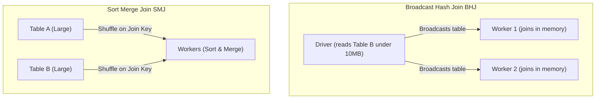

<p class="lead text-xl text-gray-300 mb-8">
    Spark SQL is not just about writing queries; it is about knowing how Spark executes them. Write a query poorly, and Spark will shuffle petabytes of data across your networks, locking up your cluster. Let's look at how the Catalyst Optimizer works and how to tune joins.
</p>

## The Brain: The Catalyst Optimizer

When you run a SQL query, Spark does not execute it line-by-line. Instead, the query goes through the **Catalyst Optimizer**.

```
[ SQL / DataFrame Query ] 
         │
         ▼
 ┌───────────────┐
 │ Logical Plan  │  <-- Parse and analyze query syntax
 └───────┬───────┘
         │  (Optimization rules: pushdown filters, prune columns)
         ▼
 ┌───────────────┐
 │ Physical Plan │  <-- Generate physical join strategies, choose code path
 └───────┬───────┘
         │  (Cost-Based Selection)
         ▼
 [ Java Bytecode Execution ]
```

> **ELI5:** What is Spark SQL and Catalyst? Think of Spark SQL like hiring a local tour guide who knows every shortcut in the city. You just tell them the list of places you want to visit, and they plan the absolute fastest route. Read [ELI5: Spark SQL & The Catalyst Optimizer](/blog/eli5/spark-sql) for the analogy.

---

## Adaptive Query Execution (AQE)

In Apache Spark 3.x, Databricks enabled **Adaptive Query Execution (AQE)** by default. 

Traditional query optimizers use static table statistics to guess the best physical plan before the query starts. But statistics are often wrong or stale. AQE changes this by re-optimizing the physical query plan *during* execution, based on the actual size of the data blocks processed.

To check if AQE is enabled on your cluster, verify these settings:
```sql
SET spark.sql.adaptive.enabled = true;
SET spark.sql.adaptive.coalescePartitions.enabled = true;
```

### The Three Superpowers of AQE:

#### 1. Coalescing Post-Shuffle Partitions
If your query shuffles data (like a `GROUP BY` or `JOIN`), Spark normally defaults to writing **200 partitions** on disk. If your data is small, this results in 200 tiny files. AQE looks at the shuffle output size and dynamically coalesces those 200 partitions into 5 larger, healthy files on the fly.

#### 2. Adaptive Join Conversions
If Spark static statistics guess that Table A is too large to broadcast, it plans a slow Sort-Merge Join. But if you run a filter that shrinks Table A down to 2 MB, AQE intercepts the execution at runtime and automatically converts the plan to a fast **Broadcast Hash Join**.

#### 3. Handling Data Skew
If one of your keys (e.g. `customer_id = 9999` for guest checkout) contains 10x more data than other keys, the worker node processing that key will lag, slowing down the entire query. AQE detects this skew and automatically splits that massive partition into smaller sub-partitions, distributing the load across other workers.

For AQE parameters, refer to the [Official Apache Spark Configuration Page](https://spark.apache.org/docs/latest/configuration.html#adaptive-query-execution).

---

## Physical Join Strategies: Broadcast vs. Sort-Merge

Understanding how Spark joins tables is critical for query design. There are two primary strategies:



### 1. Broadcast Hash Join (BHJ)
* **How it works:** The Driver reads the smaller table, builds a hash map in memory, and broadcasts (copies) that map to *every worker node*. The workers then read their slice of the large table and match rows against the local hash map.
* **Network Cost:** Low. No shuffling of the large table is needed.
* **When to use:** When one of your tables is small (default threshold is **&lt;10 MB**). 

You can increase the broadcast threshold or force a broadcast using a query hint:

```sql
-- Force Spark to broadcast the lookup_codes table
SELECT /*+ BROADCAST(codes) */ * 
FROM orders o 
JOIN lookup_codes codes ON o.code_id = codes.id;
```

### 2. Sort-Merge Join (SMJ)
* **How it works:** Spark shuffles both tables across the network based on the join key (so rows with the same key end up on the same worker). It then sorts the data on each worker and merges them.
* **Network Cost:** Very high. This triggers a full cluster shuffle.
* **When to use:** The fallback strategy for joining two very large tables that cannot fit in worker memory.


*One does not simply shuffle a petabyte of data across a gigabit network.*

---

## Reading Execution Plans with `explain()`

To check if your join strategies and filters are running correctly, use `.explain()` in your PySpark DataFrames:

```python
# Explain physical plan in PySpark
df_joined = df_orders.join(df_customers, "customer_id")
df_joined.explain(mode="formatted")
```

### What to search for in your query plans:
* **`AdaptiveSparkPlan`:** Indicates AQE is active.
* **`BroadcastHashJoin`:** The optimal join state.
* **`SortMergeJoin`:** Check if you can broadcast one of the tables to avoid the shuffle.
* **`ReusedExchange`:** Indicates Spark is reusing already shuffled data, which is an optimization.
* **`Filter ... pushdown`:** Verify that filters (like `date = '2023-10-16'`) are pushed down to the file scan stage so Spark doesn't read the whole table.

For plan syntax details, consult the [Databricks DataFrame Explain Reference](https://docs.databricks.com/en/sql/language-manual/sql-ref-syntax-qry-explain.html).

Now that we know how to write fast queries, let's look at how to organize our pipelines declaratively. In the next part, we'll build Delta Live Tables pipelines.

<div class="flex justify-between mt-12 pt-8 border-t border-gray-700">
    <a href="/blog/databricks/05-ingestion" class="text-pink-400 hover:text-pink-300 font-bold">&larr; Part 5 - Ingestion with Auto Loader</a>
    <a href="/blog/databricks/07-dlt" class="text-pink-400 hover:text-pink-300 font-bold">Next: Part 7 - Delta Live Tables Pipelines &rarr;</a>
</div>
